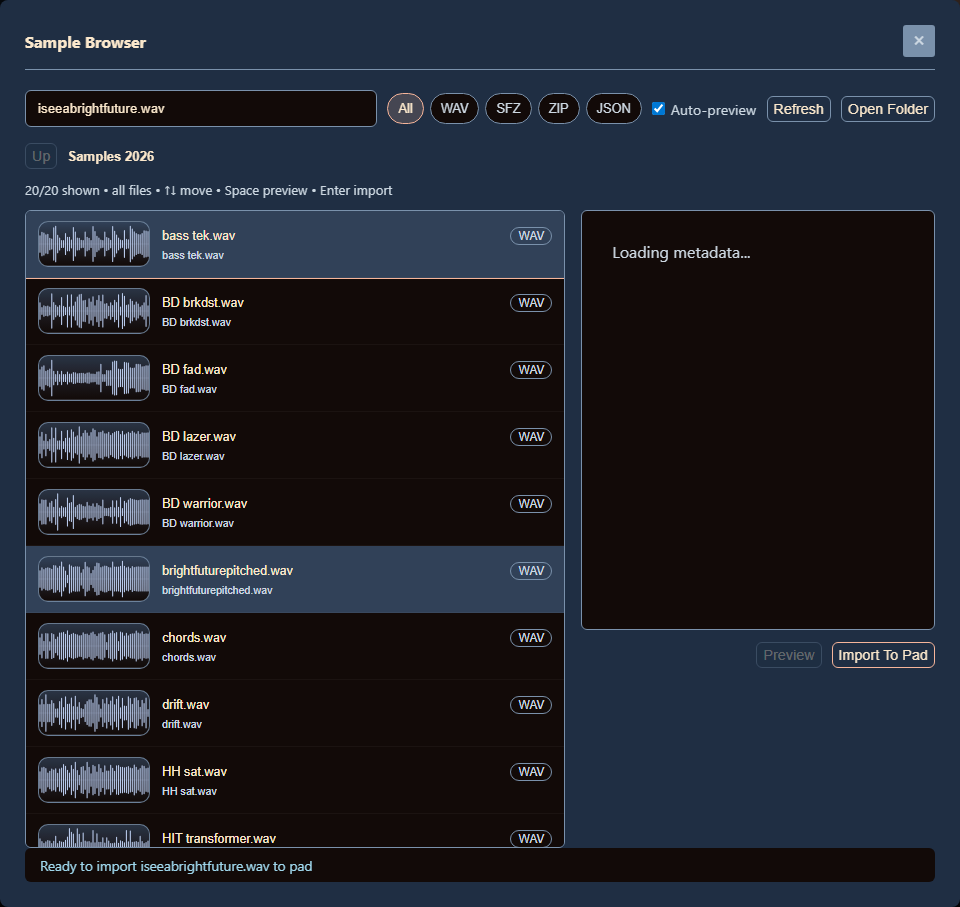
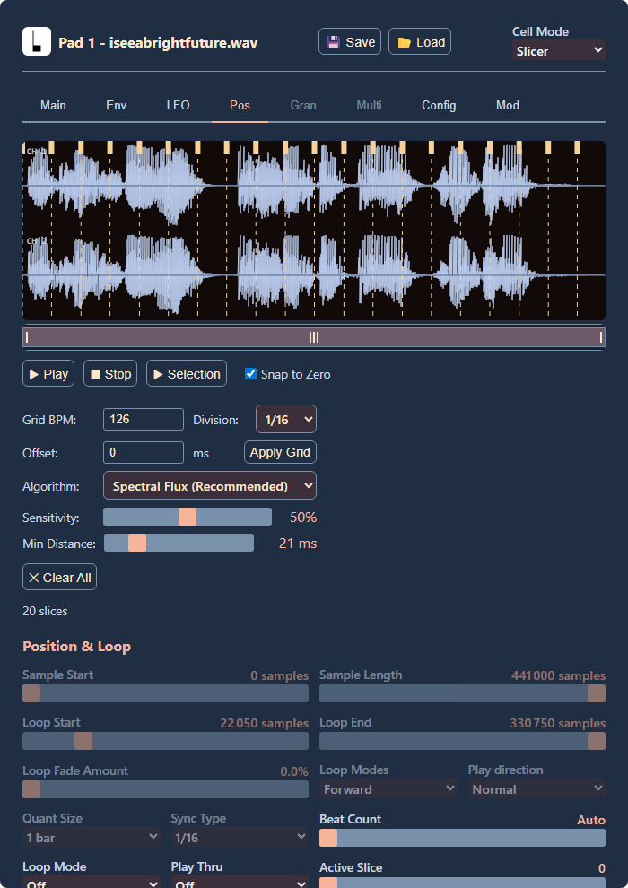
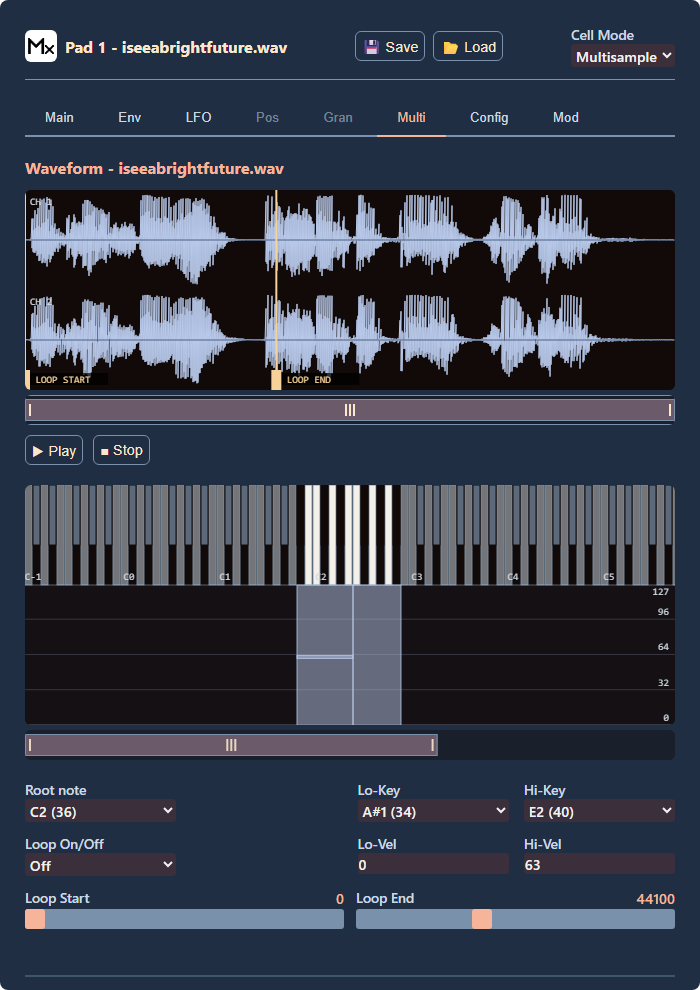

# BITBOXER Enhanced

App:
[https://kf4u43d.github.io/Bitbox-editor/](https://kf4u43d.github.io/Bitbox-editor/)

Source:
[https://github.com/kf4u43D/Bitbox-editor/tree/bitboxer-enhancements](https://github.com/kf4u43D/Bitbox-editor/tree/bitboxer-enhancements)

Fork focused on a faster Bitbox editing workflow: pad preview from the grid, local sample browser with audio preview, BPM/division grid slicing, multisample layer assignment, and UI theme support. The browser now handles local folder navigation, import preview, thumbnails in renders, and direct layer creation for multisample pads.

## Preview

## Added Features

- Pad preview directly from the main grid
- Custom browser for local samples and presets
- Audio preview before import
- BPM/division grid slicing in the waveform editor
- Multisample layer import from the keyboard view
- Theme system with updated UI states and editor colors

## Keyboard Shortcuts

- `Esc`: close dialogs and stop active preview playback
- `Arrow Up` / `Arrow Down`: move in the sample browser list
- `Arrow Left` / `Backspace`: go up one folder in the browser
- `Space`: preview the selected browser item
- `Enter`: import the selected browser item

## Browser Support

Best results:

- `Chrome`
- `Edge`

Chromium-based browsers are recommended for local folder access and the custom browser workflow.
